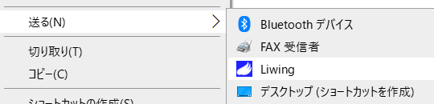
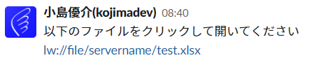
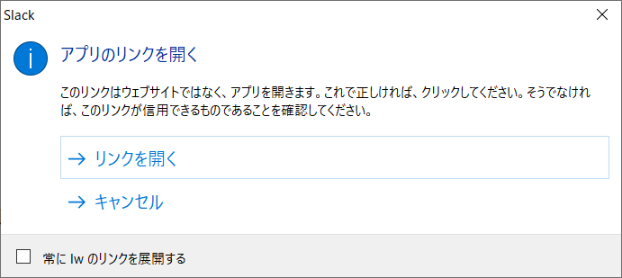

# Liwing
Liwing is a tool that allows you to click on a UNC path link in Slack to open a file directly.  
For example, if you post the link to an Excel file path called `\\servername\test.xlsx` to Slack, all you have to do is click on the link and Excel will open the file.

Liwingとは、Slack で UNCパスのリンクをクリックして直接ファイルが開けるようになるツールです。  
例えば、`\\servername\test.xlsx` というExcelファイルパスのリンクを Slack に投稿すると、そのリンクをクリックするだけで Excel を起動してそのファイルを開きます。

## Basic Usage

### How to install
Download and install LiwingSetup.msi from the link below, it is a Windows-only tool.  

以下のリンクから LiwingSetup.msi をダウンロードしてインストールしてください。Windows専用のツールです。 

[LiwingSetup.msi](https://github.com/kojimadev/Liwing/raw/master/src/ReleaseProduct/LiwingSetup.msi)

### How to post a link to Slack
For example, if you want to create a link to a file path of  `\\servername\test.xlsx`, select that file and run the menu Send-Liwing in the context menu of Explorer.  
(Installing Liwing will add the Send menu.)

例えば、`\\servername\test.xlsx` のファイルパスのリンクを作成したい場合、そのファイルを選択して、エクスプローラーのコンテキストメニューの [送る] - [Liwing] というメニューを実行します。  
(Liwingをインストールすることで、[送る]メニューが追加されます)  
  
When you do the above, a URL called `lw://file/servername/test.xlsx` is copied to the clipboard, using a custom URL scheme.  
When you post the URL to Slack, it will appear as a link as shown below.

上記を実行すると、クリップボードに `lw://file/servername/test.xlsx` というカスタムURLスキームという技術を用いた形式のURLがコピーされます。  
そのURLをSlackに投稿すると、下図のようにリンク形式で表示します。

### How to open the target file
Click on the link that starts with "lw:" above, and the following dialog will appear.  
If you select Open Link here, it will open the target file. If the file has the xlsx extension, start Excel (start with the default application per extension).  

上記の「lw:」から始まるリンクをクリックすると、下図のダイアログが表示されます。  
ここで[リンクを開く]を選択すれば、対象のファイルを開きます。ファイルがxlsxの拡張子であれば、Excelを起動します(拡張子ごとの既定のアプリケーションで起動します)。  

## Support
Have a question? Come and talk to me: [@kojimadev](https://twitter.com/kojimadev)

## License
Liwing is released under the MIT license.